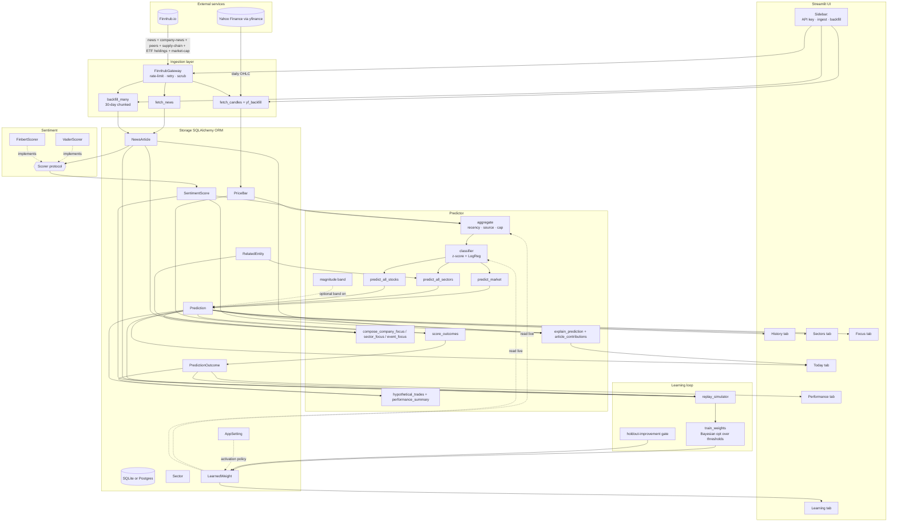

# Finn-Predictor — Software Architecture

Companion to `summary.md`. The ASCII diagram in `summary.md` is the
elevator pitch; this file is the engineer's reference — module
inventory, dependency direction, and the three runtime flows
(scheduled ingest, live UI render, training loop).

---

## Module map

```
finn_predictor/
├── config.py            (84 LOC)   — frozen Settings dataclass; env-var entry point
├── security.py          (118 LOC)  — bcrypt; SecretScrubFilter
├── logging_config.py    (113 LOC)  — text/JSON log routing + scrub filter wiring
├── cli.py               (538 LOC)  — argparse subcommands; entrypoint for headless ops
│
├── ingestion/                      — Pulls news + prices; isolates failure
│   ├── client.py        (205 LOC)  — FinnhubGateway, RateLimiter, scrub_token, IngestionError
│   ├── jobs.py          (302 LOC)  — run_daily_ingest, score_pending_articles, sector sweep
│   ├── news.py          ( 71 LOC)  — general_news + company_news fetch + dedupe by finnhub_id
│   ├── prices.py        (130 LOC)  — /stock/candle ingest (gated on free tier)
│   ├── prices_yf.py     (176 LOC)  — yfinance fallback for daily OHLC
│   └── backfill.py      (166 LOC)  — 30-day chunked /company-news backfill per ticker
│
├── sentiment/                      — Scorer interface + implementations
│   ├── base.py          ( 47 LOC)  — Scorer Protocol; resolve_active_scorer
│   ├── vader.py         ( 44 LOC)  — VaderScorer (default)
│   ├── finbert.py       ( 69 LOC)  — FinBERT (opt-in via FINN_PREDICTOR_SCORER=finbert)
│   └── __init__.py      (111 LOC)  — scorer registry; warn_if_scorer_mismatch
│
├── storage/                        — SQLAlchemy ORM + repository pattern
│   ├── engine.py        ( 75 LOC)  — create_engine_and_session; SQLite vs Postgres
│   ├── models.py        (309 LOC)  — Sector, NewsArticle, SentimentScore, PriceBar,
│   │                                 HistoricalMarketCap, Prediction, PredictionOutcome,
│   │                                 RelatedEntity, AppSetting, LearnedWeight
│   ├── repo.py          (613 LOC)  — All session.execute(...) live here; dialect-aware upserts
│   ├── stories.py       (120 LOC)  — earliest_story_times by prefix matching
│   ├── clustering.py    (275 LOC)  — Pluggable: prefix (default) | embedding
│   ├── sector_membership.py (190 LOC) — Curated ticker→SPDR-sector map + DB-cached overrides
│   └── symbol_names.py  (133 LOC)  — Curated ticker → company-name expansion
│
├── predictor/                      — From scored articles to a directional Prediction
│   ├── classifier.py    (304 LOC)  — Z-score rule + opt-in LogisticCalibration
│   ├── magnitude.py     (338 LOC)  — Quantile-band return forecast (opt-in)
│   ├── aggregate.py     (188 LOC)  — Recency-weighted, source-weighted, cap-weighted blend
│   ├── market.py        (156 LOC)  — Whole-market call (^GSPC, general news)
│   ├── sectors.py       (271 LOC)  — 11 SPDR sector ETF calls + curated synthesis
│   ├── stocks.py        (163 LOC)  — Per-ticker call; wraps predict_market with category="company"
│   ├── explain.py       (275 LOC)  — Per-article contribution + 5-paragraph "Why this Call?"
│   ├── focus.py         (606 LOC)  — Company/Sector/Event focus + RelatedEntity refresh
│   ├── backtest.py      (117 LOC)  — Pair each prediction with realised next-bar return
│   └── trades.py        (366 LOC)  — Hypothetical-trade ledger + PnL aggregation
│
├── learning/                       — Self-improvement loop
│   ├── config.py        (121 LOC)  — Dimension constants; default search space
│   ├── simulate.py      (304 LOC)  — Replay historical articles under candidate weights
│   └── train.py         (420 LOC)  — Bayesian opt; holdout gate; activate
│
└── ui/                             — Streamlit dashboard
    └── app.py          (2562 LOC)  — Single-file dashboard; tabs are just functions
```

**Total: ~10,300 LOC of Python**, plus ~3,000 LOC of tests at 96% coverage.

---

## Dependency direction (which layer depends on which)

```
                       ┌──────────────────────┐
                       │  ui/app.py           │ ◄──── entrypoint: streamlit
                       │  (top-of-tree)       │
                       └──────────┬───────────┘
                                  │ reads + writes
            ┌─────────────────────┼─────────────────────────┐
            ▼                     ▼                         ▼
   ┌────────────────┐   ┌───────────────────┐   ┌──────────────────┐
   │  predictor/*   │   │  learning/*       │   │  cli.py          │ ◄── entrypoint:
   │  (read-only    │   │  (Bayesian opt    │   │  (headless ops)  │     python -m finn_predictor.cli
   │   on storage   │   │   over storage    │   └──────────────────┘
   │   + writes     │   │   + writes        │
   │   Prediction)  │   │   LearnedWeight)  │
   └────────┬───────┘   └─────────┬─────────┘
            │                     │
            └─────────┬───────────┘
                      ▼
              ┌───────────────┐
              │  sentiment/*  │   pluggable: vader (default) | finbert
              └───────┬───────┘
                      │
            ┌─────────┼─────────┐
            ▼                   ▼
   ┌────────────────┐   ┌──────────────────┐
   │  ingestion/*   │   │  storage/*       │
   │  (write-only   │   │  (only owner of  │
   │   on storage)  │   │   the DB schema) │
   └────────┬───────┘   └──────────┬───────┘
            │                      │
            ▼                      ▼
   ┌────────────────┐      ┌──────────────────┐
   │  finnhub.Client│      │  SQLAlchemy      │
   │  + yfinance    │      │  + SQLite / PG   │
   └────────────────┘      └──────────────────┘

   config.py + security.py + logging_config.py are leaves —
   imported by everything, importing nothing inside the project.
```

**Rule:** lower-layer modules don't import higher-layer ones. `storage/`
never imports `predictor/`; `ingestion/` never imports `ui/`. This is
why we can run the ingestion job, the training loop, and the CLI in
isolation without spinning up Streamlit.

---

## High-level diagram (Mermaid — renders on GitHub / VS Code preview)



---

## Runtime flow 1: scheduled daily ingest

```
APScheduler (or operator-clicked "Run ingestion now")
  └──> run_daily_ingest(session, api_key)
       │
       ├──> ingestion/news.fetch_general_news()       → NewsArticle (category="general")
       ├──> for ticker in user_symbols:
       │     ingestion/news.fetch_company_news(t)    → NewsArticle (category="company")
       │
       ├──> score_pending_articles()                  → SentimentScore (model_version=scorer.name)
       │
       ├──> ingestion/prices.fetch_candles()         → PriceBar
       │    (or yfinance fallback in prices_yf)
       │
       ├──> for each sector etf:
       │     predictor/sectors.predict_sector()      → Prediction (target=XL*)
       │
       ├──> predictor/market.predict_market()        → Prediction (target=^GSPC)
       │
       ├──> predictor/stocks.predict_all_stocks()    → Prediction (target=<ticker>)
       │
       └──> predictor/backtest.score_outcomes()      → PredictionOutcome
            (when a next-day PriceBar exists)
```

Failure isolation: each step is wrapped in its own try/except inside
`jobs.py` so a 403 on `/stock/candle` doesn't kill the news ingest
that already finished, and a single bad ticker doesn't kill the rest.

---

## Runtime flow 2: live UI render (Today tab)

```
GET / (Streamlit WebSocket session)
  │
  ├──> _enforce_auth_gate()
  │     └──> bcrypt verify against FINN_PREDICTOR_PASSWORD_HASH
  │
  ├──> _hydrate_api_key_from_browser()
  │     └──> read window.localStorage[finn_predictor_finnhub_api_key]
  │           into st.session_state (server-side only)
  │
  ├──> _render_sidebar()
  │     └──> text_input (masked) for API key
  │     └──> text_input for comma-separated ticker list
  │     └──> "Run ingestion now" button → run_daily_ingest in band
  │
  └──> for each tab (Today | History | Sectors | Performance | Focus | Learning):
        │
        Today tab:
        ├──> predictions_for(target=^GSPC, latest_only=True)
        ├──> explain_prediction()  → 5-paragraph block
        ├──> article_contributions() → divergent Altair bar chart
        ├──> price_bars(^GSPC) → 30-day line chart
        ├──> predictions_for(target ∈ user_symbols) → per-stock table
        │    (sector-grouped via storage/sector_membership)
        ├──> compose synthesized sector predictions from user-listed stocks
        └──> Neutral headlines (|sentiment| ≤ 0.05) section
```

Every database read goes through `storage/repo.py`. No SQL or table
references appear in `ui/app.py` except through the repo functions.

---

## Runtime flow 3: training loop

```
operator clicks "Retrain" (or python -m finn_predictor.cli retrain)
  │
  ├──> train_weights(session)
  │     │
  │     ├──> load closed outcomes (Prediction × PredictionOutcome)
  │     │     bail out if fewer than MIN_TRADES_FOR_TRAINING
  │     │
  │     ├──> Bayesian optimisation (scikit-optimize gp_minimize)
  │     │     over (threshold_sigma, min_baseline_sigma, half_life_hours)
  │     │     objective: simulated hit-rate on the training split
  │     │
  │     ├──> closed-form per-source weights from source contribution-to-PnL
  │     │
  │     ├──> evaluate on the held-out tail
  │     │
  │     └──> write LearnedWeight rows (version = max_existing + 1)
  │
  ├──> get_activation_policy()
  │     ├── AUTO   → activate new version unless holdout_score
  │     │           drops below tolerance vs the live version
  │     └── MANUAL → leave new version unactivated until UI click
  │
  └──> on next ingestion / live render:
        active_weights() reads the LearnedWeight rows where is_active=True
        and feeds them into predictor/aggregate + predictor/classifier
```

---

## Data contracts (what flows where)

| Producer | Consumer | Shape | Where it's defined |
|---|---|---|---|
| Finnhub `/news`, `/company-news` | `NewsArticle` | `(finnhub_id, category, symbol, headline, summary, source, url, published_at)` | `storage/models.py:54-82` |
| `Scorer.score(text)` | `SentimentScore` | `(article_id, score ∈ [-1,1], model_version)` | `sentiment/base.py`; `storage/models.py:85-109` |
| Finnhub `/stock/candle` or yfinance | `PriceBar` | `(symbol, trade_date, OHLCV)` | `storage/models.py:112-130` |
| `predictor/aggregate` | `Prediction` | `(target_symbol, prediction_date, label ∈ {UP,DOWN,FLAT}, confidence ∈ [0,1], sentiment_index, article_count, model_version, optional return-band p10/p50/p90)` | `storage/models.py:164-206` |
| `predictor/backtest` | `PredictionOutcome` | `(prediction_id, realised_return, hit ∈ {true,false}, realised_at)` | `storage/models.py:292-309` |
| Finnhub `/peers`, `/supply-chain`, `/etf/holdings` | `RelatedEntity` | `(source_symbol, related_symbol, relationship ∈ {PEER, SUPPLIER, CUSTOMER, ETF_HOLDING}, rank, metadata_text)` | `storage/models.py:262-289` |
| `learning/train` | `LearnedWeight` | `(version, dimension ∈ {THRESHOLD_SIGMA, MIN_BASELINE_SIGMA, HALF_LIFE_HOURS, SOURCE_WEIGHT}, key, value, is_active)` | `storage/models.py:226-259` |

---

## Failure-mode catalogue (what breaks, what the user sees)

| Failure | What the code does | What the UI shows |
|---|---|---|
| Finnhub 403 on `/news` | `IngestionError` raised by gateway after token scrub | Sidebar: "`/news` 403 — key / plan issue" with the scrubbed error |
| Finnhub 403 on `/stock/candle` (free tier) | Per-endpoint try/except in `jobs.py`; news still ingests | Sidebar: "candles gated — predictions still wrote; backtest sits empty" |
| Finnhub 429 | RateLimiter blocks; 3 bounded retries with backoff | Either succeeds silently or surfaces a scrubbed error |
| SSL / DNS / connect-reset on Finnhub | `IngestionError(scrubbed)` | Same path as 403 |
| Token in error URL string | Three explicit scrub layers + regex log filter | `<REDACTED>` in every surface |
| Scorer mismatch (env was vader → finbert) | `warn_if_scorer_mismatch()` notices model_version drift | Sidebar warning + offer to rescore |
| No closed outcomes for training | `NotEnoughDataError` | Learning tab: "need ≥10 closed predictions; you have N" |
| Holdout score drops > tolerance | New version written but `is_active=False` | Learning tab: red banner with "Activate anyway" override |
| ETF holdings gated on free tier | Fall back to curated `sector_membership` map | Sector tab: synthesized sector call from user-listed constituents |

---

## Where new features plug in

When extending the project, prefer the lowest layer that's still
specific to your change. Concrete examples of where things go:

| Feature class | Layer | Existing reference |
|---|---|---|
| A new news source (RSS, Twitter X-feed) | `ingestion/` + a new `Scorer`-compatible normalizer | `ingestion/news.py` |
| A new sentiment model | `sentiment/` (implement `Scorer` Protocol) + register in `sentiment/__init__.py` | `sentiment/finbert.py` |
| A new prediction kind (commodity, FX) | `predictor/` (new module that returns `Prediction` rows) | `predictor/stocks.py` |
| A new relationship type (e.g. THEME) | `storage/models.py` (extend `RelatedEntity.relationship` allowed-set) + a new ingestion fetch | `predictor/focus.py:504-595` |
| A new UI tab | `ui/app.py` (tab is just a function called from `main()`) | `ui/app.py` Today / History / etc. |
| A new headless operation | `cli.py` (new argparse subparser → call into the right layer) | `cli.py:refresh-constituents` |
| A new self-improvement axis | `learning/config.py` (declare the dimension) + `learning/train.py` (extend the search space) + `learning/simulate.py` (consume it during replay) | `learning/config.py:DIM_*` |
